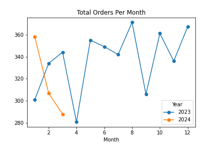
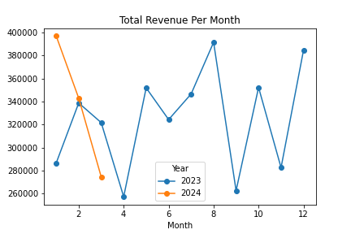
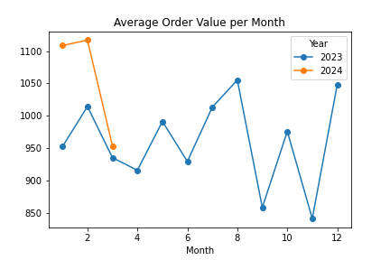
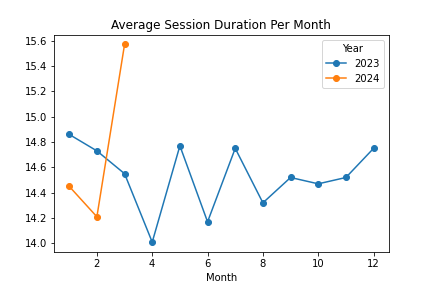
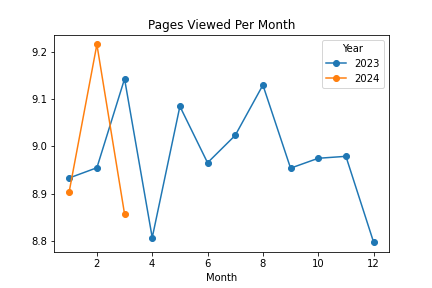
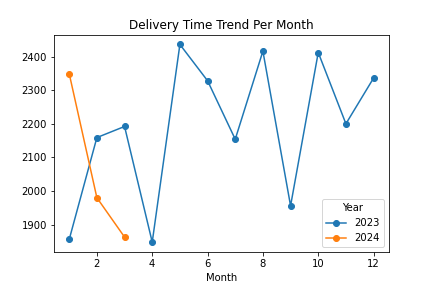
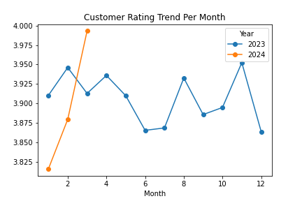

<<<<<<< HEAD
<<<<<<< HEAD
# E-Commerce-Performance-and-Engagement-Analysis
=======
# Statistical-Analysis-Engine with Numpy
This project experiments the performance differences between loop-based and vectorized implementations of common statistical operations using Numpy, with a focus on 1D and 2D arrays.

This project was created to learn more on vectorization and understand the conditions involved when vectorized Numpy operations outperform traditional Python loops and when they do not. Each statistical operation was implemented twice; using Python loops and using Numpy vectorized operations. Execution time was measured using Jupyter's '%timeit' to compare performance.

## Features
- Mean and median calculation
- Variance computation
- Minimum and Maximum value computation
- Loop-based vs vectorized performance comparison
- Support for both 1D and 2D arrays

## Technologies
- Python
- Numpy
- Jupyter Notebook

## Performance Findings
- For small 1D datasets, loop-based implementations performed almost equivalently or slightly faster due to lower overhead.
- For 2D arrays, the performance gap was more visible as vectorized Numpy operations performed significantly better in terms of performance and lower execution time.

## What I learned
- Vectorization is not always faster for small datasets.
- Vectorization saves a lot of time compared to loops and mastering it will be valuable in the long run.
>>>>>>> ed0497b81a101050b17687753f9f9be8a1d02be1
=======
# Project Title
Year-over-Year E-Commerce Performance & Engagement Analysis (2023 vs 2024)
## Project Overview
- The dataset contains detailed e-commerce transactional and behavioral data, including:
   * Order Information: Order ID, customer ID, date, product category, unit price, quantity, discount amount, total amount, payment method.
   * Customer Demographics: Age, gender, city, returning customer status.
   * Engagement Metrics: Device type, session duration (minutes), pages viewed.
   * Operational Metrics: Delivery time (days), customer rating.

- The goal of this project is to analyze customer behavior, platform engagement, and sales performance for an e-commerce platform across 2023 and 2024. The analysis aims to identify trends, uncover insights into customer purchasing and engagement patterns, and provide actionable recommendations to improve platform performance and user experience.

## Key Analyses Conducted
1. Monthly Analysis:
   * Total orders per month
   * Total revenue per month
   * Average order value (AOV)
   * Average session duration
   * Pages viewed
   * Delivery time
   * Customer ratings
2. Customer Segmentation Analysis:
   * Returning vs New customers
   * Device type (Mobile, Desktop, Tablet)
   * Age groups
   * Product categories
3. Engagement Funnel Analysis
   * Classification of customers into High, Medium, Low engagement based on session duration and pages viewed
   * Monthly engagement trends and comparisons across 2023 and 2024
  
# Key Insights
- Peaks in orders and revenue correspond with seasonal events and campaigns.
- Returning customers are more loyal, spend more per order, and are more engaged.
- Mobile users dominate high engagement and revenue, highlighting the importance of mobile optimization.
- Young users (18–25) spend the most and are highly engaged, while older users show lower engagement.
- Electronics generate the most revenue, while books generate the least; customer ratings are consistent across product categories.
- 2024 shows improved engagement retention compared to 2023, particularly for high-engagement users.

# Visualizations
1. Monthly Analysis
   * Total Orders per Month
     
   * Total Revenue per month
     
   * Average order value (AOV)
     
   * Average Session Duration
     
   * Pages Viewed
     
   * Delivery Time
     
   * Customer ratings
     

  2. Engagement Funnel Analysis
     

# Tools and Libraries Used
- **Python**: Pandas, NumPy, Matplotlib
- **Visualization**: Line plots and funnel charts
- **Version Control**: Git & GitHub

# Outcome & Impact
This project provides actionable insights for the e-commerce platform, including:
  * Optimizing marketing campaigns based on seasonal purchase trends
  * Targeting high-value segments like returning and mobile users
  * Identifying engagement gaps in specific age groups and product categories
  * Making data-driven decisions to enhance customer retention and satisfaction
>>>>>>> afe3e5f325707064dfde2b456d38593f0cb637ff
